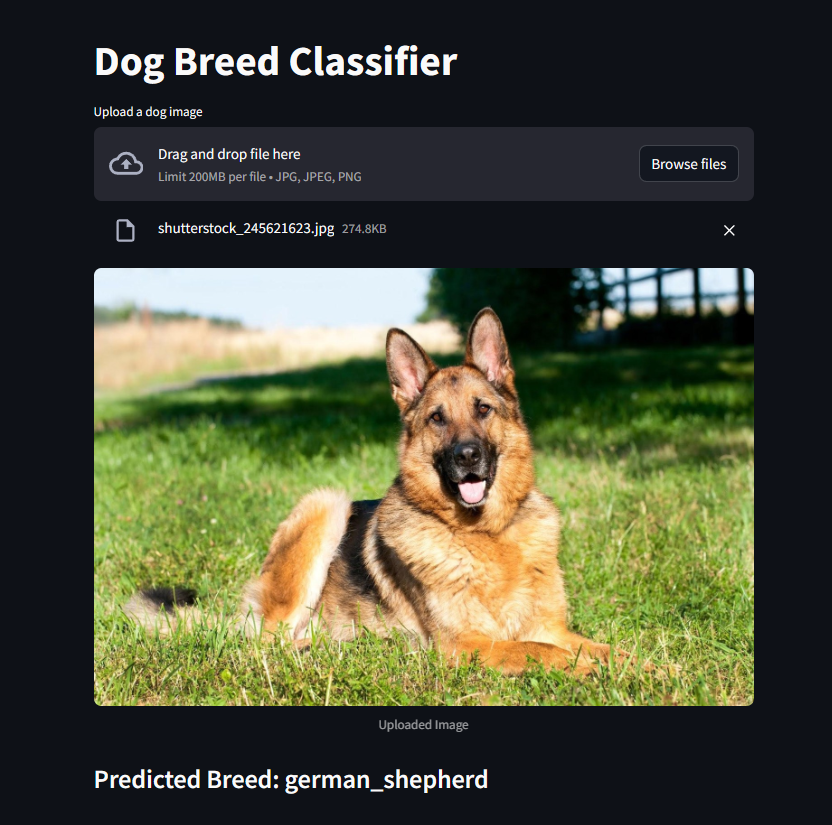
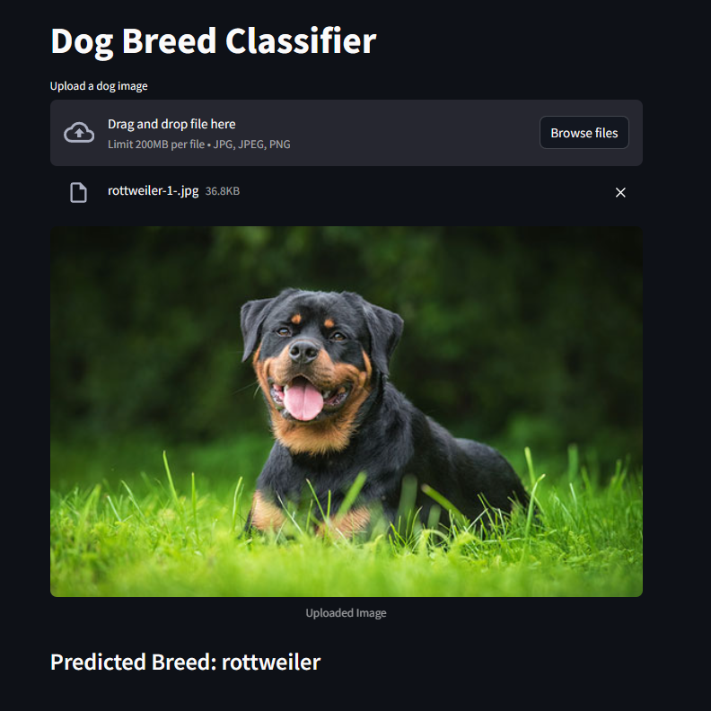
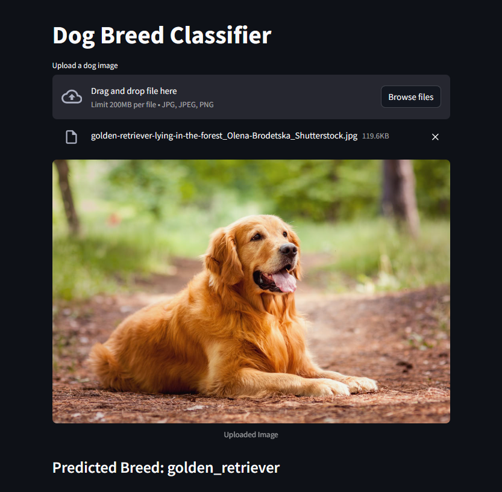
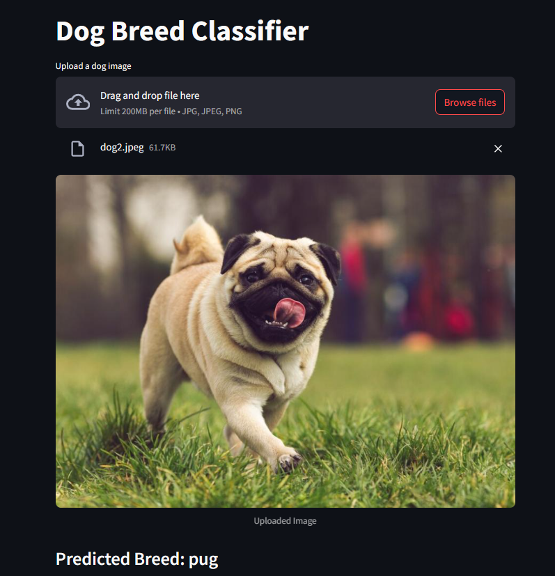

# Dog Breed Image Classifier

This project is a **Convolutional Neural Network (CNN)** based classifier that identifies the **breed of a dog** from an image using **transfer learning** with **MobileNetV2**.

It allows users to upload a dog image and returns the predicted breed with high accuracy.

---

## Features

- Classifies **120+ dog breeds** using deep learning.
- Built with **TensorFlow/Keras** and **MobileNetV2** (transfer learning).
- Uses **Streamlit** for a simple, clean web interface.
- Trained on the **Kaggle Dog Breed Identification dataset**.
- Displays uploaded image and predicted breed on the frontend.

---

## Technologies Used

- **Python**
- **TensorFlow / Keras**
- **Pandas / NumPy**
- **Scikit-learn**
- **Streamlit** (for the web UI)
- **Pre-trained MobileNetV2** as the base CNN

---

## How to Run

### 1. Install dependencies

```bash
pip install tensorflow pandas numpy scikit-learn streamlit opencv-python
```

---

### 2. Train the model (Run once)

This will train the CNN on dog breeds and save the model and label encoder.

```bash
python dog.py
```

---

### 3. Launch the Streamlit app

```bash
streamlit run app.py
```

Then open your browser at [http://localhost:8501](http://localhost:8501)

---

## Input

- Upload an image (`.jpg`) of a dog via the web interface.

---

## Output

- You will see:
  - The uploaded image
  - The predicted breed

---

## Output Samples





